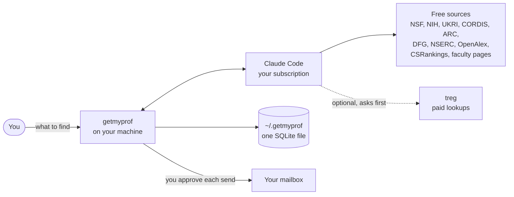
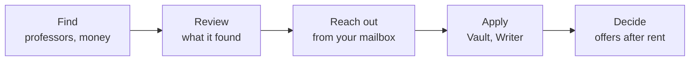

# getmyprof

Find professors who can fund your degree, and the money behind them. Then reach out, apply and
compare offers. It runs on your machine, on your own Claude subscription.

[](https://www.npmjs.com/package/getmyprof)
[](https://github.com/EhsanulHaqueSiam/getmyprof/releases/latest)


## Install

macOS, Linux or Windows, with Node 24 or newer:

```sh
npx getmyprof@latest
```

Keep the command:

```sh
npm install -g getmyprof
getmyprof
```

No Node? This one brings its own:

```sh
curl -fsSL https://github.com/EhsanulHaqueSiam/getmyprof/releases/latest/download/install.sh | sh
```

On Windows, in PowerShell:

```powershell
irm https://github.com/EhsanulHaqueSiam/getmyprof/releases/latest/download/install.ps1 | iex
```

### Desktop app

```sh
# the Mac app, or the Linux AppImage with a menu entry
curl -fsSL https://github.com/EhsanulHaqueSiam/getmyprof/releases/latest/download/install.sh | sh -s -- --desktop

# Mac, with Homebrew
brew install --cask EhsanulHaqueSiam/tap/getmyprof

# Debian, Ubuntu: download the .deb from Releases, then
sudo apt install ./getmyprof_*.deb
```

Any other Linux, Arch included: download the `.AppImage` from
[Releases](https://github.com/EhsanulHaqueSiam/getmyprof/releases/latest), `chmod +x` it and run it.
The Mac app isn't notarized yet. Homebrew and the one-liner handle that; a dmg dragged in from the
browser needs `xattr -dr com.apple.quarantine /Applications/getmyprof.app` once.

Windows: download `getmyprof-<version>-x64-setup.exe` from
[Releases](https://github.com/EhsanulHaqueSiam/getmyprof/releases/latest) and run it, or the `.msi`
for managed installs. It isn't code-signed yet, so Windows asks once: More info, then Run anyway.

### Update

| Installed with              | Update                                                 |
| --------------------------- | ------------------------------------------------------ |
| npm                         | `npm install -g getmyprof@latest`                      |
| the one-liner               | `getmyprof update`                                     |
| Mac app, Homebrew, AppImage | Update, in the app                                     |
| Windows setup `.exe`        | Update, in the app                                     |
| `.deb`                      | the app opens the release; `sudo apt install` that one |
| `.msi`                      | the app opens the release; install that one            |

## Commands

| Command                         | What it does                                      |
| ------------------------------- | ------------------------------------------------- |
| `getmyprof`                     | starts it and opens your browser; Ctrl-C stops it |
| `getmyprof serve`               | keeps it running in the background                |
| `getmyprof stop`                | stops the background server                       |
| `getmyprof login`               | signs in to Claude in the terminal                |
| `getmyprof update`              | installs the newest release                       |
| `getmyprof --version`, `--help` |                                                   |

With npx: `npx getmyprof@latest serve`. It opens at http://127.0.0.1:4350. Your data lives in
`~/.getmyprof`; `GETMYPROF_HOME=/somewhere/else getmyprof` keeps it elsewhere.

## First run


1. **Connect.** Sign in to Claude. Paid lookups through treg are optional.
2. **You.** Paste your CV and tick the facts that are right.
3. **Your hunt.** Degree, intake, places, fields, the least funding you'd take.
4. **Detail and budget.** How deep to dig, and the most it may spend.

## How it works



Free sources cost nothing. A paid lookup costs cents, asks first above $0.01, and never passes your
caps per thread, loop run and day.



| **Hunt**: ask in plain words; it searches grants, faculty pages, papers | **Results**: one grid per thread; act on the rows you pick |
| ----------------------------------------------------------------------- | ---------------------------------------------------------- |
|                                 |                    |
| **Funding**: awards from 7 funders, by months left after your intake    | **Professors**: your sheet, by fit, money and students     |
|                                 |              |
| **Review**: nothing lands in your sheet without you                     | **Professor**: every fact with its source and date         |
|                                   |              |
| **Pipeline**: drafts wait for you; sends go at 08:00 their time         | **Board**: every professor by stage                        |
|                               |                        |
| **Vault**: your life as dated facts, with proof                         | **Writer**: statements and CVs citing only proven facts    |
|                                     |                      |
| **Offers**: compared after rent                                         | **Loops**: hunts on a schedule or a webhook                |
|                                   |                        |
| **⌘K**: jump anywhere, run any action                                   | **Settings**: detail, budget, treg, mailbox, MCP           |
|                            |                  |


**On your phone.** Settings has a link and a QR code that open it over Tailscale.

**Your data stays yours.** One SQLite file, backed up and restored in one click; professors export as
CSV. No telemetry and no getmyprof server; mail goes from your own mailbox.

**Other agents** drive it over MCP at `/api/mcp`, with the config Settings gives you.

Every feature, with the check that proves it: [docs/features.md](docs/features.md).

<br clear="right">

## Develop

Needs tmux, and [Vite+](https://viteplus.dev) or Node 24+ with pnpm. React 19, TanStack Router,
Zustand, Tailwind v4 and zod; a Node server runs the agent sessions, loops and the send queue.

```sh
curl -fsSL https://vite.plus | bash   # Vite+, once
vp i                                  # or: pnpm install
scripts/dev-local.sh up               # server :4311 + web http://127.0.0.1:5174, in tmux
scripts/dev-local.sh share            # open it from your phone over Tailscale
scripts/dev-local.sh down

pnpm lint && pnpm typecheck && pnpm test

# e2e, on a fresh stack with the scripted agent (free, deterministic)
rm -rf /tmp/gc-e2e && GETMYPROF_HOME=/tmp/gc-e2e GETMYPROF_AGENT=fake scripts/dev-local.sh up
pnpm e2e
```

Build what a release ships, into `dist/release`:

```sh
pnpm dist runtime                       # web app, bundled server and CLI
pnpm dist cli darwin-arm64              # the command line tarball (also darwin-x64, linux-x64, linux-arm64)
pnpm dist desktop mac arm64             # dmg + zip; `desktop linux x64` builds the AppImage + .deb
pnpm dist npm                           # the npm package
pnpm --filter @getmyprof/desktop start  # run the app from the checkout
```

Cut a release: bump `version` in `package.json`, merge it, then
`git tag vX.Y.Z && git push origin vX.Y.Z`.

| Read                                                     | For                        |
| -------------------------------------------------------- | -------------------------- |
| [AGENTS.md](AGENTS.md)                                   | working on it, start here  |
| [docs/internals/overview.md](docs/internals/overview.md) | how the pieces fit         |
| [docs/internals/release.md](docs/internals/release.md)   | releases and every channel |
| [docs/mocks/](docs/mocks/)                               | the approved design        |
